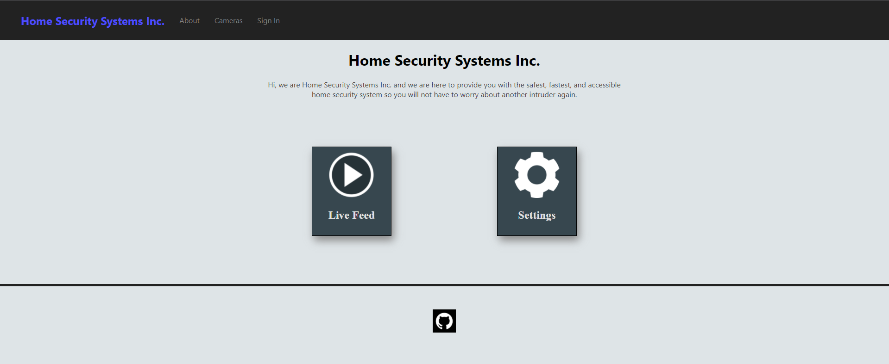
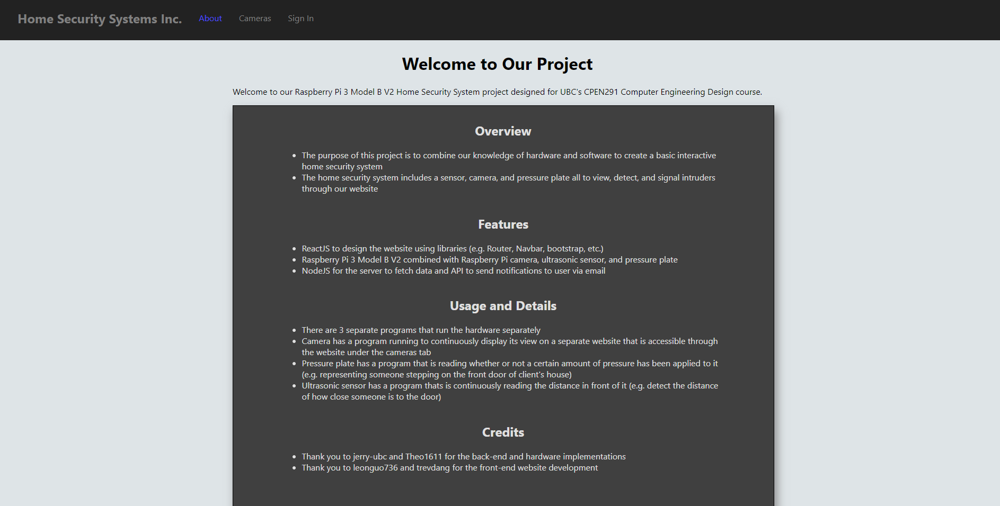
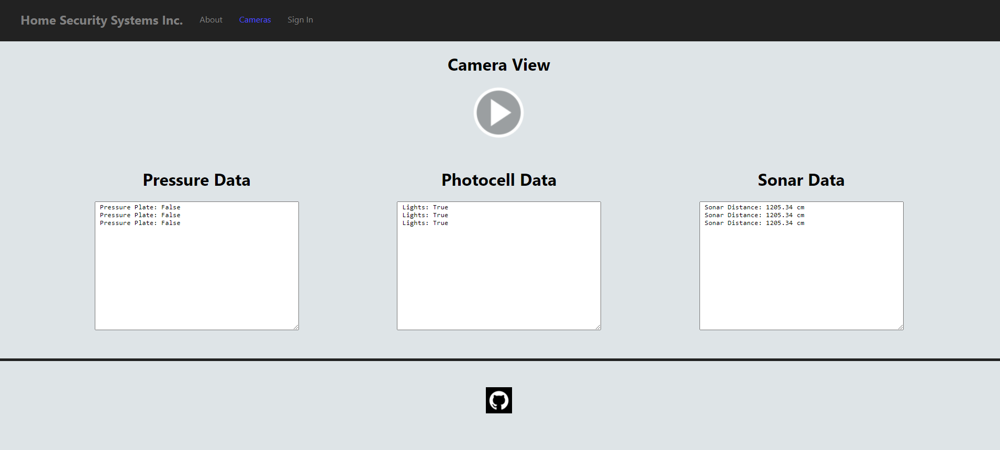
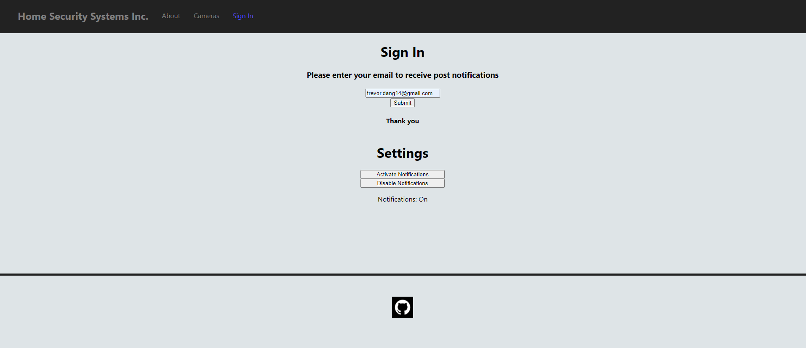
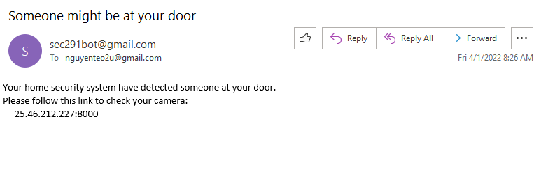

# Home Security System Webpage

A webpage for Raspberry Pi 3 Model B V2 Home Security System project designed for UBC's CPEN291 Computer Engineering Design course.

Example Images of how the website interacts with the back-end server:

- Home Page:

- About Page:

- Camera Page:

- Sign In Page:

- Notification Email:

